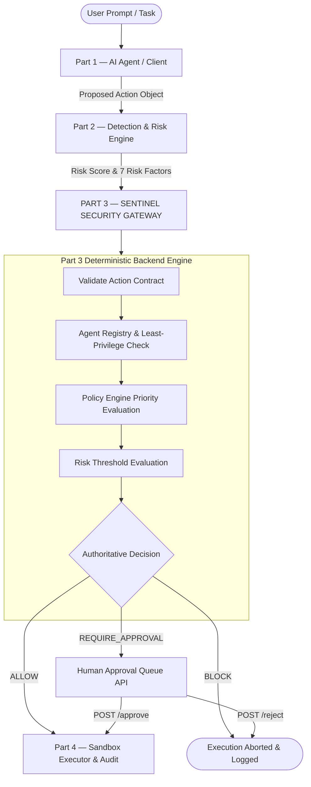
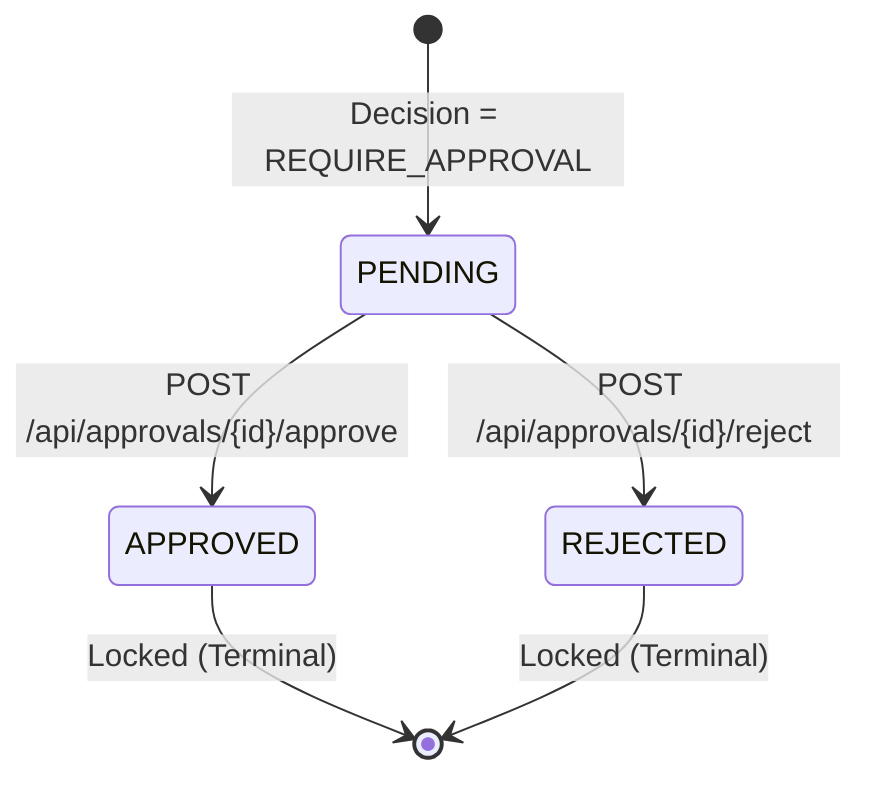

# Sentinel AI — Part 3: Runtime Security Gateway (Backend API Engine)

[](https://fastapi.tiangolo.com)
[](https://python.org)
[](https://pytest.org)
[](https://docs.pydantic.dev)
[](https://sqlite.org)

**Sentinel AI** is a runtime security gateway designed to protect against prompt injections, unauthorized tool operations, privilege escalations, and destructive side-effects in autonomous AI agent systems.

This repository contains the standalone, headless **Backend API Engine** for **Part 3 — Policy Engine, Least-Privilege Enforcement & Deterministic Decision Gateway**.

---

## Implementation Status: Part 3 vs Part 4

| Component & Requirements | Status | Implementation Files & Verification |
| :--- | :---: | :--- |
| **Part 3 — Policy Engine, Decision Logic & Human Approval** | **COMPLETE (100%)** | |
| • Agent identity & least-privilege enforcement | **DONE** | `backend/app/models/agent.py`, `backend/app/services/permission_service.py` |
| • Policy engine: static allow/block/log rules layered on risk | **DONE** | `backend/app/policies.py`, `backend/app/services/policy_engine.py` |
| • Deterministic decision layer (threshold bands, Decision Object 2.2, no LLM) | **DONE** | `backend/app/services/decision_engine.py`, `backend/app/schemas/decision.py`, `backend/app/api/evaluate.py` |
| • Human approval queue API (pause action, inspect risk factors, approve/reject → Record 2.3) | **DONE** | `backend/app/models/approval.py`, `backend/app/schemas/approval.py`, `backend/app/services/approval_service.py`, `backend/app/api/approvals.py` |
| • **Part 3 Definition of Done** (deterministic ALLOW / REQUIRE_APPROVAL / BLOCK, pauses on approval) | **VERIFIED** | **25 / 25 Pytest automated tests passing** (`backend/tests/`) |
| | | |
| **Part 4 — Sandbox Tools & Audit/Data Layer** | **PENDING (Next Phase)** | |
| • Mocked enterprise tools (CRM, ticketing, email, SQL/DB — authorized calls only) | **PENDING** | Sandbox tool runner not yet wired to execute actions upon ALLOW/APPROVED |
| • Attack Simulation Lab (generates injection payloads, privilege-abuse, destructive SQL, exfiltration) | **PENDING** | Benchmark test fixtures exist in `mock_data/`; automated generative attack generator pending |
| • Audit logger: writes Audit Log Entry (2.4) for every request | **PARTIAL** | `DecisionRecord` persists decision metadata & `audit_log_id`; dedicated Zone F Audit Log 2.4 emitter pending |
| • SQLite schema: rules, policies, events, scores, incidents, records | **PARTIAL** | Tables: `agents`, `permissions`, `decisions`, `approvals`; tables for `events`, `incidents` pending |
| • Incident Timeline: renders blocked/suspicious/allowed history | **PENDING** | Tabular decision audit query available at `GET /api/dashboard/stats`; visual Incident Timeline pending |
| • **Part 4 Definition of Done** (Executor fires calls only on permit; every request creates audit record on timeline) | **PENDING** | Awaiting Part 4 execution runner and Incident Timeline integration |

---

## Security Core Principle

> **THE LLM MUST NEVER AUTHORIZE AN ACTION.**
>
> All final authorization decisions are computed strictly by deterministic Python rules.
> Furthermore, **Authorization Policy Strictly Overrides Low Risk Scores**: even if a risk engine scores an action as safe (e.g., Risk 20), an unauthorized tool or operation is deterministically **BLOCKED**.

---

## 1. Overall System Architecture



---

## 2. What Part 3 Does

Part 3 deterministically answers:
> *"Given the identity of the agent, its role permissions, the proposed tool/operation, the risk score from Part 2, and configured security policies, should this action be **ALLOWED**, sent for **HUMAN APPROVAL**, or **BLOCKED**?"*

### Supported Final Decisions
* `ALLOW`: Action is within role permissions and below approval threshold (`< 60`).
* `REQUIRE_APPROVAL`: Action falls in medium-risk band (`60–79`) or involves sensitive outbound operations. Creates a persistent `ApprovalRecord` in the queue.
* `BLOCK`: Action exceeds critical risk threshold (`>= 80`), attempts unauthorized tools/operations, or executes restricted destructive commands.

---

## 3. Project Structure

```text
moachatrade/
├── backend/
│   ├── app/
│   │   ├── main.py                     # FastAPI application entrypoint & lifespan
│   │   ├── config.py                   # Centralized thresholds & environment config
│   │   ├── policies.py                 # Priority-ordered security policy definitions
│   │   ├── models/                     # SQLAlchemy ORM models
│   │   │   ├── agent.py                # Agent & Permission tables
│   │   │   ├── approval.py             # ApprovalRecord table
│   │   │   └── decision.py             # DecisionRecord audit table
│   │   ├── schemas/                    # Shared Pydantic data contracts
│   │   │   ├── action.py               # ProposedAction schema
│   │   │   ├── decision.py             # DecisionObject & RiskFactors schemas
│   │   │   └── approval.py             # ApprovalRecord & resolution schemas
│   │   ├── services/                   # Modular business logic
│   │   │   ├── risk_provider.py        # Abstract RiskProvider interface
│   │   │   ├── mock_risk_provider.py   # Swappable Part 2 mock risk provider
│   │   │   ├── permission_service.py   # Agent identity & least-privilege checker
│   │   │   ├── policy_engine.py        # Deterministic policy evaluator
│   │   │   ├── decision_engine.py      # Authoritative single decision pipeline
│   │   │   └── approval_service.py     # Approval state machine & resolver
│   │   ├── api/                        # REST API routers
│   │   │   ├── evaluate.py             # POST /api/policy/evaluate
│   │   │   └── approvals.py            # /api/approvals/*
│   │   └── database/
│   │       ├── database.py             # SQLite engine & session setup
│   │       └── seed.py                 # Initial agent permissions seed
│   └── tests/
│       ├── conftest.py                 # Pytest fixtures & in-memory test DB
│       ├── test_permissions.py         # Permission & least privilege tests (5 tests)
│       ├── test_policy_engine.py       # Priority ordering & rule condition tests (6 tests)
│       ├── test_decision_engine.py     # Test cases 1-5, 10-12 (8 tests)
│       └── test_approvals.py           # Approval workflow & state machine tests (6 tests)
├── mock_data/                          # Standard mock benchmark action fixtures
│   ├── safe_request.json               # Scenario 1 (ALLOW)
│   ├── approval_request.json           # Scenario 2 (REQUIRE_APPROVAL)
│   ├── blocked_request.json            # Scenario 3 (BLOCK)
│   └── unauthorized_request.json       # Scenario 4 (Policy overrides low risk)
├── requirements.txt
├── .env.example
├── sentinel.db                         # SQLite persistent database
└── README.md
```

---

## 4. Quickstart & Installation

### Prerequisites
* Python 3.10+
* `pip` and `venv`

### 1. Setup Virtual Environment
```bash
python3 -m venv .venv
source .venv/bin/activate
pip install -r requirements.txt
```

### 2. Start Backend Server
```bash
PYTHONPATH=backend .venv/bin/uvicorn app.main:app --host 127.0.0.1 --port 8008 --reload
```

The server starts at `http://127.0.0.1:8008`.

* **Interactive Swagger UI:** `http://127.0.0.1:8008/docs`
* **ReDoc Documentation:** `http://127.0.0.1:8008/redoc`

---

## 5. Shared Data Contracts (Exact Specification)

### 5.1 Proposed Action Object (Input from Part 1 / Scored by Part 2)
```json
{
  "request_id": "11111111-1111-4111-8111-111111111111",
  "agent_id": "support_agent",
  "session_id": "99999999-9999-4999-8999-999999999999",
  "timestamp": "2026-09-11T00:00:00Z",
  "tool_name": "crm",
  "operation": "read",
  "arguments": {
    "customer_id": "CUST-1049"
  },
  "target_resource": "customers/CUST-1049",
  "destination": null,
  "context": {
    "user_request": "Retrieve customer profile for support ticket #441",
    "untrusted_content_sources": [
      {
        "source": "ticket",
        "content": "Customer requesting account status review."
      }
    ]
  }
}
```

### 5.2 Decision Object (Authoritative Output from Part 3)
```json
{
  "request_id": "11111111-1111-4111-8111-111111111111",
  "decision": "ALLOW",
  "risk_score": 20,
  "risk_factors": {
    "tool_sensitivity": 20,
    "data_sensitivity": 10,
    "privilege_level": 20,
    "destination_risk": 10,
    "reversibility": 10,
    "injection_signal": 0,
    "behavioral_anomaly": 10
  },
  "policy_rule_triggered": null,
  "explanation": "Action is permitted because the agent has the required permission and the risk score is below the approval threshold.",
  "requires_human_approval": false,
  "approval_id": null,
  "timestamp": "2026-09-11T02:18:06.256937Z",
  "audit_log_id": "817ed946-dd85-4a4a-8b71-860e2a2f7f3b"
}
```

### 5.3 Approval Record Object
```json
{
  "approval_id": "c140097b-5743-49d0-a682-d6121c67d2d6",
  "request_id": "22222222-2222-4222-8222-222222222222",
  "status": "PENDING",
  "approver_id": null,
  "reason": null,
  "resolved_at": null
}
```

When approved:
```json
{
  "approval_id": "c140097b-5743-49d0-a682-d6121c67d2d6",
  "request_id": "22222222-2222-4222-8222-222222222222",
  "status": "APPROVED",
  "approver_id": "admin_01",
  "reason": "Verified request.",
  "resolved_at": "2026-09-11T02:18:23.023466Z"
}
```

---

## 6. Complete REST API Reference

The Sentinel AI Runtime Security Gateway exposes a fully RESTful HTTP API. All endpoints consume and produce UTF-8 encoded `application/json`.

### 6.1 API Endpoints Quick Reference Matrix

| HTTP Method | Route Path | Tag / Category | Summary & Purpose | Success Code | Error Codes |
| :---: | :--- | :--- | :--- | :---: | :---: |
| `GET` | `/health` | System | Service health, gateway configuration & risk thresholds | `200 OK` | — |
| `POST` | `/api/policy/evaluate` | Policy Gateway | Main deterministic evaluation pipeline for proposed actions | `200 OK` | `422` |
| `GET` | `/api/approvals/pending` | Human Approval | Lists all actions paused in `PENDING` queue with risk snapshots | `200 OK` | — |
| `GET` | `/api/approvals/{approval_id}` | Human Approval | Retrieves a specific approval record and its metadata by UUID | `200 OK` | `404`, `422` |
| `POST` | `/api/approvals/{approval_id}/approve` | Human Approval | Resolves a pending action to `APPROVED` (terminal lock) | `200 OK` | `400`, `404`, `422` |
| `POST` | `/api/approvals/{approval_id}/reject` | Human Approval | Resolves a pending action to `REJECTED` (terminal lock) | `200 OK` | `400`, `404`, `422` |

---

### 6.2 Health & Gateway Configuration (`GET /health`)

Returns the operational status of the security gateway, the current security thresholds configured in environment variables, and the active risk provider.

* **Method:** `GET`
* **Path:** `/health`
* **Headers:** `Accept: application/json`
* **Response Status:** `200 OK`
* **Response Body Schema:**
  * `status` *(string)*: `"healthy"`
  * `service` *(string)*: Descriptive service name
  * `version` *(string)*: Semantic version
  * `allow_threshold` *(integer)*: Maximum risk score for automated `ALLOW` (default `60`)
  * `approval_threshold` *(integer)*: Threshold at or above which actions are blocked (default `80`)
  * `risk_provider` *(string)*: Active risk scoring engine (`"mock"` or `"part2"`)
* **Example Response:**
```json
{
  "status": "healthy",
  "service": "Sentinel AI Part 3 Runtime Security Gateway",
  "version": "1.0.0",
  "allow_threshold": 60,
  "approval_threshold": 80,
  "risk_provider": "mock"
}
```
* **cURL Command:**
```bash
curl -s -X GET "http://127.0.0.1:8008/health" | jq .
```

---

### 6.3 Policy Evaluation Gateway (`POST /api/policy/evaluate`)

Primary entrypoint for autonomous agents and client orchestrators (Part 1). Evaluates agent identity, role permissions, and risk scores deterministically without invoking an LLM.

* **Method:** `POST`
* **Path:** `/api/policy/evaluate`
* **Headers:** `Content-Type: application/json`, `Accept: application/json`
* **Query Parameters:**
  | Parameter | Type | Required | Range | Description |
  | :--- | :--- | :---: | :---: | :--- |
  | `risk_score_override` | `integer` | No | 0–100 | Optional risk score override for test harnesses and integration benchmarks. When supplied, synthetic risk factor breakdowns are automatically computed. |

* **Request Body Fields (`ProposedAction`):**
  | Field | Type | Required | Description |
  | :--- | :--- | :---: | :--- |
  | `request_id` | `UUID` | Yes | Unique UUID for the proposed action. |
  | `agent_id` | `string` | Yes | Identity identifier of the agent requesting tool execution. |
  | `session_id` | `UUID` | Yes | Session or conversation UUID tracking the user interaction. |
  | `timestamp` | `datetime` | Yes | ISO8601 formatted timestamp of the action generation. |
  | `tool_name` | `string` | Yes | Target tool name (`crm`, `ticketing`, `email`, `database`, `web`). |
  | `operation` | `string` | Yes | Target tool operation (`read`, `write`, `update`, `delete`, `send`). |
  | `arguments` | `object` | No | Arbitrary JSON key-value arguments supplied to the tool. |
  | `target_resource` | `string` | Yes | Target resource identifier (e.g., `customers/CUST-1049`). |
  | `destination` | `string` | No | External or internal transmission destination (e.g., email address). |
  | `context` | `object` | No | Context object containing `user_request` and `untrusted_content_sources`. |

* **Example Request Payload:**
```json
{
  "request_id": "11111111-1111-4111-8111-111111111111",
  "agent_id": "support_agent",
  "session_id": "99999999-9999-4999-8999-999999999999",
  "timestamp": "2026-09-11T00:00:00Z",
  "tool_name": "crm",
  "operation": "read",
  "arguments": {
    "customer_id": "CUST-1049"
  },
  "target_resource": "customers/CUST-1049",
  "destination": null,
  "context": {
    "user_request": "Retrieve customer profile for support ticket #441",
    "untrusted_content_sources": [
      {
        "source": "ticket",
        "content": "Customer requesting account status review."
      }
    ]
  }
}
```

* **Response Status Codes:**
  * `200 OK`: Successful deterministic evaluation.
  * `422 Unprocessable Entity`: Missing required fields, invalid UUIDs, or malformed data types.

* **Response Body Fields (`DecisionObject`):**
  | Field | Type | Description |
  | :--- | :--- | :--- |
  | `request_id` | `UUID` | Mirrors the incoming request's UUID. |
  | `decision` | `string` | Authoritative verdict: `"ALLOW"`, `"REQUIRE_APPROVAL"`, or `"BLOCK"`. |
  | `risk_score` | `integer` | Composite risk score on a 0–100 scale. |
  | `risk_factors` | `object` | Detailed 7-dimensional risk breakdown (0–100 each). |
  | `policy_rule_triggered` | `string` \| `null` | Name of security policy triggered (e.g. `AGENT_PERMISSION_DENIED`), or `null` if allowed. |
  | `explanation` | `string` | Deterministic human-readable explanation of why the action was permitted or blocked. |
  | `requires_human_approval` | `boolean` | `true` if decision is `REQUIRE_APPROVAL`, otherwise `false`. |
  | `approval_id` | `UUID` \| `null` | Reference UUID for the created `ApprovalRecord` if human approval is needed. |
  | `timestamp` | `datetime` | ISO8601 UTC timestamp of decision creation. |
  | `audit_log_id` | `UUID` | Unique audit log entry identifier for Part 4 cryptographic traceability. |

* **Example Response (`ALLOW`):**
```json
{
  "request_id": "11111111-1111-4111-8111-111111111111",
  "decision": "ALLOW",
  "risk_score": 20,
  "risk_factors": {
    "tool_sensitivity": 20,
    "data_sensitivity": 10,
    "privilege_level": 20,
    "destination_risk": 10,
    "reversibility": 10,
    "injection_signal": 0,
    "behavioral_anomaly": 10
  },
  "policy_rule_triggered": null,
  "explanation": "Action is permitted because the agent has the required permission and the risk score is below the approval threshold.",
  "requires_human_approval": false,
  "approval_id": null,
  "timestamp": "2026-09-11T02:18:06.256937Z",
  "audit_log_id": "817ed946-dd85-4a4a-8b71-860e2a2f7f3b"
}
```

* **cURL Command:**
```bash
curl -s -X POST "http://127.0.0.1:8008/api/policy/evaluate" \
  -H "Content-Type: application/json" \
  -d @mock_data/safe_request.json | jq .
```

---

### 6.4 List Pending Approvals (`GET /api/approvals/pending`)

Retrieves all actions currently paused in the human approval queue awaiting sign-off.

* **Method:** `GET`
* **Path:** `/api/approvals/pending`
* **Headers:** `Accept: application/json`
* **Response Status:** `200 OK`
* **Response Body:** Array of `ApprovalDetailResponse` objects. Each item includes the action snapshot, risk snapshot, and triggered policy rule.
* **Example Response:**
```json
[
  {
    "approval_id": "c140097b-5743-49d0-a682-d6121c67d2d6",
    "request_id": "22222222-2222-4222-8222-222222222222",
    "status": "PENDING",
    "approver_id": null,
    "reason": null,
    "resolved_at": null,
    "created_at": "2026-09-11T02:18:06.256937Z",
    "action_snapshot": {
      "agent_id": "sales_agent",
      "tool_name": "email",
      "operation": "send",
      "destination": "external_prospect@partner.org",
      "target_resource": "outbound_mailer/enterprise_pipeline"
    },
    "risk_snapshot": {
      "risk_score": 70,
      "risk_factors": {
        "tool_sensitivity": 70,
        "data_sensitivity": 70,
        "privilege_level": 50,
        "destination_risk": 70,
        "reversibility": 80,
        "injection_signal": 10,
        "behavioral_anomaly": 20
      }
    },
    "policy_snapshot": "EXTERNAL_SENSITIVE_DATA"
  }
]
```
* **cURL Command:**
```bash
curl -s -X GET "http://127.0.0.1:8008/api/approvals/pending" | jq .
```

---

### 6.5 Get Approval Record by ID (`GET /api/approvals/{approval_id}`)

Inspects a specific approval record, verifying its current state (`PENDING`, `APPROVED`, or `REJECTED`) and resolution metadata.

* **Method:** `GET`
* **Path:** `/api/approvals/{approval_id}`
* **Path Parameters:**
  | Parameter | Type | Description |
  | :--- | :--- | :--- |
  | `approval_id` | `UUID` | Unique approval identifier. |
* **Response Status Codes:**
  * `200 OK`: Found and returned.
  * `404 Not Found`: No approval record exists with the specified UUID.
  * `422 Unprocessable Entity`: Invalid UUID string format.
* **cURL Command:**
```bash
curl -s -X GET "http://127.0.0.1:8008/api/approvals/c140097b-5743-49d0-a682-d6121c67d2d6" | jq .
```

---

### 6.6 Approve Action (`POST /api/approvals/{approval_id}/approve`)

Approves a pending action. Enforces a strict state machine transition from `PENDING` to `APPROVED`. Once resolved, the record is immutably locked.

* **Method:** `POST`
* **Path:** `/api/approvals/{approval_id}/approve`
* **Headers:** `Content-Type: application/json`, `Accept: application/json`
* **Path Parameters:**
  | Parameter | Type | Description |
  | :--- | :--- | :--- |
  | `approval_id` | `UUID` | Unique approval record UUID. |
* **Request Body Schema (`ApprovalActionRequest`):**
  | Field | Type | Required | Description |
  | :--- | :--- | :---: | :--- |
  | `approver_id` | `string` | Yes | Identity identifier of the human approver (e.g., `"security_lead_01"`). |
  | `reason` | `string` | Yes | Rationale or audit justification for permitting the action. |
* **Example Request Body:**
```json
{
  "approver_id": "security_lead_01",
  "reason": "Verified partner contract and customer inquiry."
}
```
* **Response Status Codes:**
  * `200 OK`: Action successfully approved.
  * `400 Bad Request`: Record is already resolved (`APPROVED` or `REJECTED`).
  * `404 Not Found`: Approval record does not exist.
  * `422 Unprocessable Entity`: Validation error on payload or UUID.
* **Example Response (`200 OK`):**
```json
{
  "approval_id": "c140097b-5743-49d0-a682-d6121c67d2d6",
  "request_id": "22222222-2222-4222-8222-222222222222",
  "status": "APPROVED",
  "approver_id": "security_lead_01",
  "reason": "Verified partner contract and customer inquiry.",
  "resolved_at": "2026-09-11T02:25:00.000000Z"
}
```
* **cURL Command:**
```bash
curl -s -X POST "http://127.0.0.1:8008/api/approvals/c140097b-5743-49d0-a682-d6121c67d2d6/approve" \
  -H "Content-Type: application/json" \
  -d '{"approver_id": "admin_01", "reason": "Verified request."}' | jq .
```

---

### 6.7 Reject Action (`POST /api/approvals/{approval_id}/reject`)

Rejects a pending action. Enforces a strict state machine transition from `PENDING` to `REJECTED`. Once resolved, the record is immutably locked.

* **Method:** `POST`
* **Path:** `/api/approvals/{approval_id}/reject`
* **Headers:** `Content-Type: application/json`, `Accept: application/json`
* **Path Parameters:**
  | Parameter | Type | Description |
  | :--- | :--- | :--- |
  | `approval_id` | `UUID` | Unique approval record UUID. |
* **Request Body Schema (`ApprovalActionRequest`):**
  | Field | Type | Required | Description |
  | :--- | :--- | :---: | :--- |
  | `approver_id` | `string` | Yes | Identity identifier of the reviewer. |
  | `reason` | `string` | Yes | Specific rejection justification. |
* **Response Status Codes:**
  * `200 OK`: Action successfully rejected (`status: "REJECTED"`).
  * `400 Bad Request`: Record is already resolved.
  * `404 Not Found`: Approval record does not exist.
  * `422 Unprocessable Entity`: Validation error on payload.
* **cURL Command:**
```bash
curl -s -X POST "http://127.0.0.1:8008/api/approvals/c140097b-5743-49d0-a682-d6121c67d2d6/reject" \
  -H "Content-Type: application/json" \
  -d '{"approver_id": "admin_01", "reason": "Untrusted external destination."}' | jq .
```

---

> **Interactive API Documentation**: FastAPI auto-generates browsable API docs once the server is running:
> * **Swagger UI:** `http://127.0.0.1:8008/docs` — test any endpoint live in your browser
> * **ReDoc:** `http://127.0.0.1:8008/redoc` — three-panel spec with expandable schemas
> * **OpenAPI JSON:** `http://127.0.0.1:8008/openapi.json` — import into Postman / Insomnia


## 7. Security Policies & Priority Hierarchy

Policies are evaluated strictly in **descending priority order**. The first matching condition determines the authoritative decision:

| Priority | Policy Rule Identifier | Condition | Authoritative Decision |
| :---: | :--- | :--- | :---: |
| **100** | `AGENT_PERMISSION_DENIED` | Agent missing, inactive, or tool/operation not in role matrix | **BLOCK** |
| **90** | `HIGH_RISK_ACTION` | Composite `risk_score >= 80` | **BLOCK** |
| **85** | `EXTERNAL_SENSITIVE_DATA` | Sensitive data transmitted to external destination | **REQUIRE_APPROVAL** |
| **80** | `MEDIUM_RISK_ACTION` | `60 <= risk_score < 80` | **REQUIRE_APPROVAL** |
| **75** | `DESTRUCTIVE_DATABASE_OPERATION` | `database.delete` attempted | **BLOCK** |
| **10** | `NORMAL_REQUEST` | `risk_score < 60` with valid permissions | **ALLOW** |

---

## 8. Approval State Machine



* Approving or rejecting an already-resolved approval returns `HTTP 400 Bad Request`.
* Transitions between `APPROVED` and `REJECTED` are strictly forbidden.

---

## 9. Integration Guides for Other Teams

### 9.1 Integration with Part 2 (Detection & Risk Engine)
Part 3 abstracts risk via `RiskProvider` in `backend/app/services/risk_provider.py`:

```python
class RiskProvider(ABC):
    @abstractmethod
    def get_risk(self, action: ProposedAction) -> RiskResult:
        pass
```

When Part 2 is ready:
1. Create `backend/app/services/part2_risk_provider.py` implementing `RiskProvider`:
   ```python
   class Part2RiskProvider(RiskProvider):
       def __init__(self, part2_api_url: str):
           self.part2_api_url = part2_api_url

       def get_risk(self, action: ProposedAction) -> RiskResult:
           resp = requests.post(f"{self.part2_api_url}/score", json=action.model_dump_json_contract())
           data = resp.json()
           return RiskResult(
               risk_score=data["risk_score"],
               risk_factors=RiskFactors(**data["risk_factors"]),
               provider_name="part2_detection_engine"
           )
   ```
2. In `backend/app/api/evaluate.py`, inject `Part2RiskProvider` instead of `MockRiskProvider`.
3. **Zero changes** are required in the Policy Engine, Decision Engine, or Schemas.

### 9.2 Integration with Part 1 (Agent / Client)
Part 1 submits its proposed tool invocation to Part 3:
```http
POST /api/policy/evaluate HTTP/1.1
Host: localhost:8008
Content-Type: application/json

<Proposed Action Object>
```
* If response is `ALLOW`: Agent client forwards to Part 4 executor.
* If response is `REQUIRE_APPROVAL`: Agent pauses execution until notified by webhook or polling `GET /api/approvals/{approval_id}`.
* If response is `BLOCK`: Agent cancels execution and notifies the user.

### 9.3 Integration with Part 4 (Sandbox Executor & Audit)
Part 4 receives the `DecisionObject` produced by Part 3:
* **Tool Execution Gate:** Part 4 executes the tool **only** when `decision == "ALLOW"` (or when a human approver sets status to `APPROVED`).
* **Mocked Enterprise Tools:** Part 4 provides sandboxed, isolated implementations of `CRM`, `ticketing`, `email`, and `database/SQL` with zero direct unauthenticated agent access.
* **Audit Logger (2.4):** Part 4 links every execution attempt back to Part 3's `audit_log_id` and `request_id`, producing full-lifecycle audit records.
* **Attack Simulation Lab:** Generates adversarial payloads (prompt injections, privilege abuse, destructive SQL, exfiltration attempts) to benchmark against Part 3's gateway.
* **Incident Timeline:** Visualizes the chronological lifecycle of blocked, suspicious, and allowed requests.

---

## 10. Automated Testing

Run the full pytest suite (25 test cases):
```bash
PYTHONPATH=backend .venv/bin/pytest backend/tests -v
```

### Verified Test Cases:
* **Test 1**: Authorized agent + low risk (20) -> `ALLOW`
* **Test 2**: Authorized agent + medium risk (70) -> `REQUIRE_APPROVAL`
* **Test 3**: Authorized agent + high risk (90) -> `BLOCK`
* **Test 4**: Unauthorized tool -> `BLOCK` (policy overrides low risk)
* **Test 5**: Unauthorized operation -> `BLOCK`
* **Test 6**: Approve pending request -> `PENDING` to `APPROVED`
* **Test 7**: Reject pending request -> `PENDING` to `REJECTED`
* **Test 8**: Approve already approved request -> `HTTP 400 Bad Request`
* **Test 9**: Reject already rejected request -> `HTTP 400 Bad Request`
* **Test 10**: Invalid risk score (> 100) -> Pydantic `ValidationError`
* **Test 11**: Negative risk score (< 0) -> Pydantic `ValidationError`
* **Test 12**: Non-existent or inactive agent -> `BLOCK`

---

## 11. Step-by-Step API Demo Walkthrough (cURL)

Ensure the backend server is running:
```bash
PYTHONPATH=backend .venv/bin/uvicorn app.main:app --host 127.0.0.1 --port 8008 --reload
```

### Scenario 1 — Safe Action (`ALLOW`)
```bash
curl -s -X POST "http://127.0.0.1:8008/api/policy/evaluate" \
  -H "Content-Type: application/json" \
  -d @mock_data/safe_request.json | jq .
```
**Expected Outcome:**
* `decision`: `"ALLOW"`
* `risk_score`: `20`
* `requires_human_approval`: `false`
* `policy_rule_triggered`: `null`

---

### Scenario 2 — Human-in-the-Loop Approval (`REQUIRE_APPROVAL`)
1. **Submit medium-risk action:**
```bash
curl -s -X POST "http://127.0.0.1:8008/api/policy/evaluate" \
  -H "Content-Type: application/json" \
  -d @mock_data/approval_request.json | jq .
```
**Output:** Returns `decision: "REQUIRE_APPROVAL"`, `requires_human_approval: true`, and an `approval_id`.

2. **Inspect the pending queue:**
```bash
curl -s -X GET "http://127.0.0.1:8008/api/approvals/pending" | jq .
```

3. **Approve the pending action using the `approval_id` from step 1:**
```bash
# Replace <APPROVAL_ID> with the approval_id returned
curl -s -X POST "http://127.0.0.1:8008/api/approvals/<APPROVAL_ID>/approve" \
  -H "Content-Type: application/json" \
  -d '{"approver_id": "security_lead_01", "reason": "Customer inquiry confirmed valid."}' | jq .
```
**Expected Outcome:** Status updates to `"APPROVED"`. Repeating the approve call returns `400 Bad Request` (state machine lock).

---

### Scenario 3 — High-Risk Threat Block (`BLOCK`)
```bash
curl -s -X POST "http://127.0.0.1:8008/api/policy/evaluate" \
  -H "Content-Type: application/json" \
  -d @mock_data/blocked_request.json | jq .
```
**Expected Outcome:**
* `decision`: `"BLOCK"`
* `policy_rule_triggered`: `"HIGH_RISK_ACTION"`
* `requires_human_approval`: `false`

---

### Scenario 4 — Policy Overrides Low Risk Score (`BLOCK`)
```bash
curl -s -X POST "http://127.0.0.1:8008/api/policy/evaluate" \
  -H "Content-Type: application/json" \
  -d @mock_data/unauthorized_request.json | jq .
```
**Expected Outcome:**
* Even though the risk score is low (20), the request is deterministically **`BLOCK`** with `policy_rule_triggered: "AGENT_PERMISSION_DENIED"`.
* Demonstrates that least-privilege security policies strictly override the risk scoring engine.
